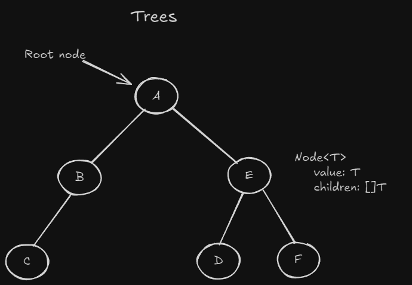
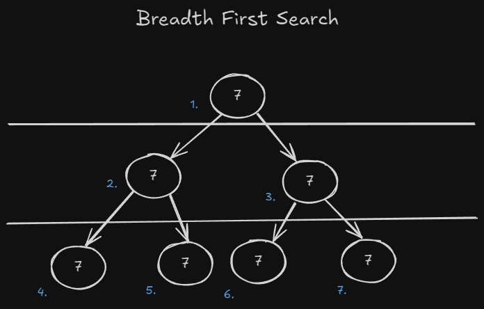

Trees are [[Data-Structure]]s which represent a type of hierarchy. Think filesystems, the DOM, and much more.



### Tree Terminology

* Binary tree - A tree in which nodes have at most 2 children, at least 0 children.
* General tree - A tree with 0 or more children.
* Binary search tree - A tree which has a specific ordering to the nodes and at most 2 children.
* Root - The most parent node. The first.
* Leaves - A node with no children.
* Height - The longest path from the root to the most child node.
* "Balanced" - A tree is _perfectly_ balanced when any node's left and right children have the same height.
* Branching factor - The amount of children a tree has.

### Traversals

There are different ways in which you can visit the nodes of a tree.

* Pre order - Start at the top, interact with the node, recurse starting to the left.
* In order - Start at the top, recurse starting to the left, interact with the node.
* Post order - Start at the top, recurse starting to the right, interact with the node.

```java
public class PreOrderSearchSolution {
	private ArrayList<int> walk(Optional<BinaryTreeNode<int> curr>, ArrayList<int> path) {
		if (!curr) {
			return path;
		}

		// recurse
		// pre
		path.add(curr.value);

		// recurse
		walk(curr.left, path);
		walk(curr.right, path);

		// post
		return path;
	}

	public ArrayList<int> preOrderSearch(BinaryTreeNode<int> head) {
		ArrayList<int> path = new ArrayList<int>();
		return walk(head, path);
	}
}

public class InOrderSearchSolution {
	private ArrayList<int> walk(Optional<BinaryTreeNode<int> curr>, ArrayList<int> path) {
		if (!curr) {
			return path;
		}

		walk(curr.left, path);
		path.add(curr.value); // <- Go left first, then visit the node.
		walk(curr.right, path);

		return path;
	}

	public ArrayList<int> preOrderSearch(BinaryTreeNode<int> head) {
		ArrayList<int> path = new ArrayList<int>();
		return walk(head, path);
	}
}

public class PostOrderSearchSolution {
	private ArrayList<int> walk(Optional<BinaryTreeNode<int> curr>, ArrayList<int> path) {
		if (!curr) {
			return path;
		}

		walk(curr.left, path);
		walk(curr.right, path);
		path.add(curr.value); // <- Go right, then visit the node.

		return path;
	}

	public ArrayList<int> preOrderSearch(BinaryTreeNode<int> head) {
		ArrayList<int> path = new ArrayList<int>();
		return walk(head, path);
	}
}
```

## Searching

### Breadth-First Search


When performing a BFS, you visit every node in one level before moving onto the next.

```java
class BFSSolution {
	public boolean bfs(BinaryTreeNode<int> head, int needle) {
		Queue<BinaryTreeNode> q = new ArrayDeque<BinaryTreeNode>();
		q.add(head);

		while (q.length > 0) {
			BinaryTreeNode curr = q.poll();

			// search
			if (curr.value == needle) {
				return true;
			}
			if (curr.left != null) {
				q.add(curr.left);
			}
			if (curr.right != null) {
				q.add(curr.right);
			}
		}
		return false;
	}
}
```
### Depth-First Search

## Sources:

* [[The Last Algorithms Course You'll Need]]