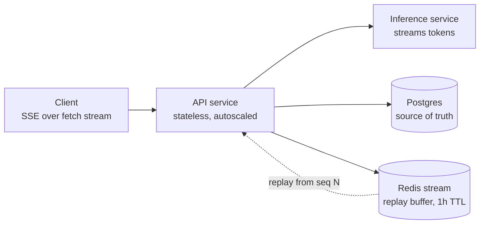
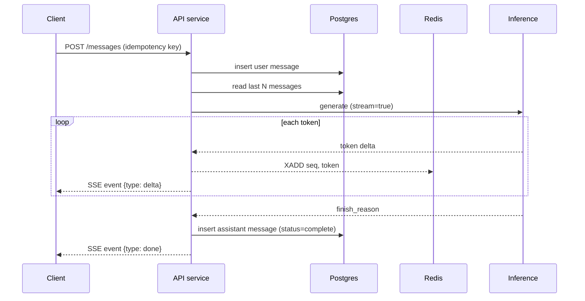
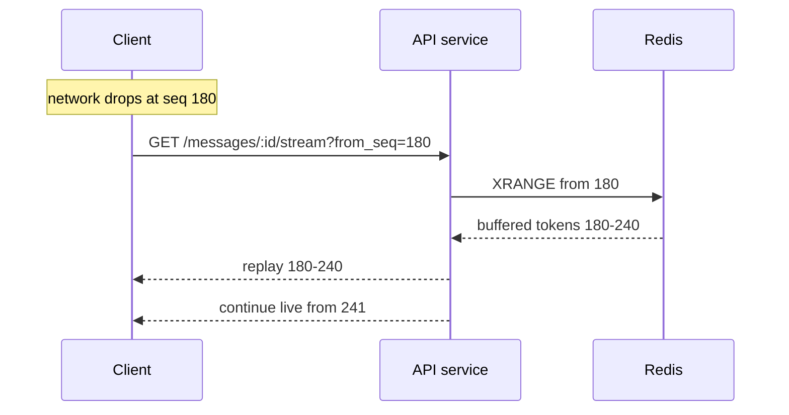
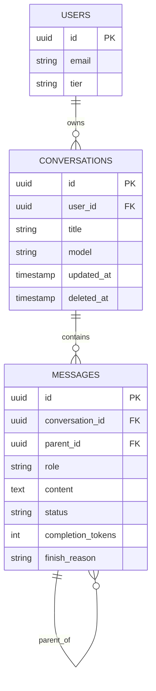
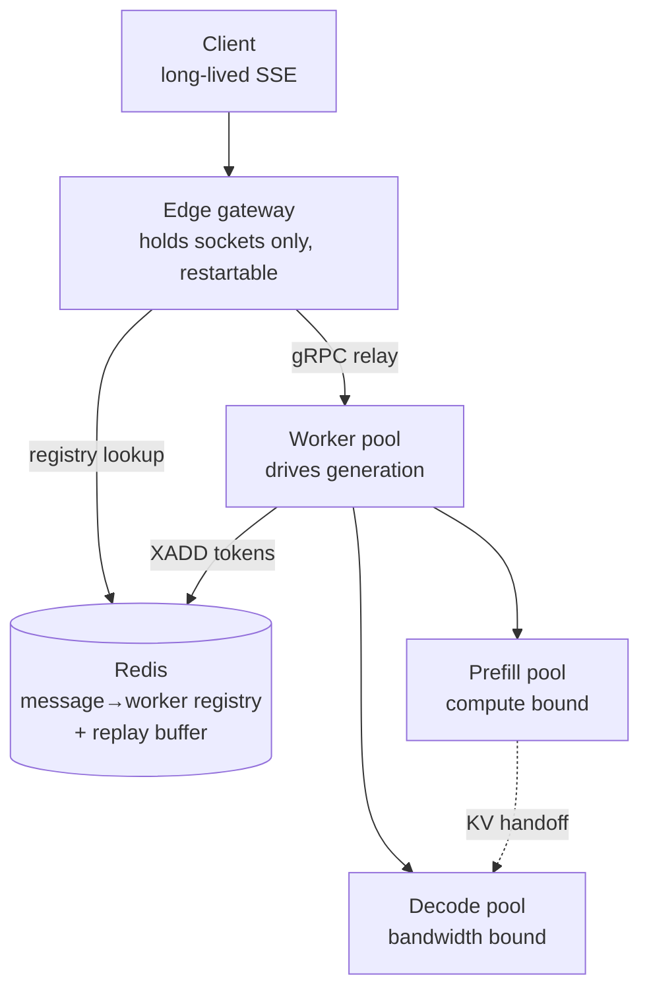

---
tags:
  - interview-prep
  - system-design
---
# Design ChatGPT (product/full-stack emphasis)
Target: core design complete by minute 35, two deep dives, then scaling pressure.
## Prompt
Design a chat application backed by an LLM: user sends a message, the model's reply streams back token by token. Conversations persist.

Start with the MVP for 100k users, we'll scale from there. Sketch the client too.

**Follow-up script:**
* SSE vs WebSockets - pick and defend.
* The stream dies at token 200 - what does the client show, and can it resume?
* Where does conversation history live and what's the schema?
* The model takes 30s worst-case - how does that shape timeouts everywhere in the chain? 

Now 100M users:
* What's stateless and what isn't?
* Rate limiting per user. How do you show "the model is typing" honestly?

## Walk through it
This is a bit different than your typical system design problem because of the introduction of the LLM magic. The single most important question here **are we serving our own model? or calling some inference API?** For the scope of this walk-through, we'll assume there is some inference API owned by another team and we will focus on the chat application & the that thing's lifecycle.

Things to clarify -
- Is it 100k MAU or concurrent? Let's say MAU.
- For multi-turn do we re-send the full history at each turn? MVP yes, with token budget truncation. No RAG, no memory.
- Does a stream need to survive a page reload or a phone dropping off wifi? This one is load-bearing, and it's safe to assume the answer will be yes.
- Multi-device sync? Same-account second tab?
- Out of scope for the MVP, and stated explicitly - attachments, tools, images, sharing, voice, teams / orgs.

Back of the envelope -
100k MAU, 10% DAU = 10k daily actives, ~10 messages each = 100k messages/day = 1.2 msg/s, maybe 12 msgs at peak.

In terms of sheer volume, thats nothing. The tricky thing here is each message / session holds an open connection for 10-60 seconds while we wait for tokens to generate. Concurrency is `arrival_rate * duration`, so `(12 per second) * 30s = 360 long lived concurrent sessions at peak`.

For storage, 100k 2KB messages per day is ~200MB/day, 70GB/year. That's nothing. One database can handle that comfortably.

### The core of the problem
The amount of traffic is tiny, the data is tiny, the interesting thing here is the long-lived concurrent connections.

The frontend can just be a react app which talks to our backend API service. Keep in mind because of the long lived connections we will need a generous idle timeout, and `proxy_buffering` disabled. Idle timeout for obvious reasons, proxy buffering would interrupt the stream back to the frontend.

For transport we have 3 choices -
1. **WebSocket** - bidirectional, one connection multiplexing everything. But it's stateful, complicates load balancing and deployments, and we'd need our own heartbeat and reconnection logic. Overkill since the stream would just flow one way (token stream coming server -> client).
2. **Long polling** - would work, but very chunky and wasteful approach.
3. **SSE** - unidirectional server -> client, matching the shape of the problem. Works over plain HTTP so any proxy would work, has reconnection logic built in through its own `Last-Event-ID`.

SSE is the correct choice here given the built in reconnect support and the unidirectional streaming, but you don't have a ton of experience with SSE directly, so just say that in the interview.

### Architecture

#### The write-path, step by step
1. `POST /conversations/:id/messages` with a client generated idempotency key. Server writes the message to Postgres synchronously before the token generation starts. This ensures durability if we were to crash while generating the response.
2. Assemble context - last N messages, truncated to token budget, plus system prompt.
3. Call inference with streaming enabled.
4. For each token: relay to the client as an SSE event and append to a Redis stream keyed by message ID, with sequence number and ~1hr TTL.
5. On completion: write full response to Postgres with full text, token count, model version, and finish reason (status). Let the Redis buffer expire.



Why Redis in the middle? - this is the part that you need to say clearly. **The response generation CANNOT be coupled to the client directly**. If the client connection drops off mid-generation (phone loses network, etc), we'd lose the whole reply, wasting the GPU compute. Treat this Redis as an intermediate buffer we write to, which the client can pull from, this way we can always replay the stream if needed (if generation is still in progress). If the response is already finished we can pull from Postgres, so that part is simple. This middle buffer also gives us multi-tab support for free.



There is one more resiliency issue here which our MVP design doesn't fully account for which is worth calling out. The generation is still coupled to one pod of our API service. If that pod were to crash or be rotated for whatever reason, we lose the generation. The obvious fix here is to decouple - instead of calling the inference API directly, the API service simply enqueues a job which owns this call to a worker pool (i.e. temporal). The worker pool drives who calls inference, and who owns writing the stream, allowing our API service to simply subscribe to it as needed, from any individual pod. This buys us much more graceful error handling if our API service pods were to crash, and cleans up our ops as we can do deployments without caring about breaking user connections.

Cancellation also deserves a special mention: when the user hits stop, we need to propagate that cancel to the inference layer, not just close to the end. That's real GPU capacity and money we'd be wasting otherwise. We can still persist the partial replay with a `finish_reason = CANCELLED` or something because the user would still be able to see our partial reply at that point.

#### Data model
```
users(id, email, tier, created_at)
conversations(id, user_id, title, model, created_at, updated_at, deleted_at). # deleted_at to "soft delete" or tombstone convos, not actually clean them up.
messages(id, conversation_id, parent_id, role, content, status, model, prompt_tokens, completion_tokens, finish_reason, created_at)
```


A few things to defend here -
- `parent_id` - a conversation is a tree, not a list. This costs one nullable field and makes edit-to-resend and regenerate trivial later. The UI just renders the active leaf-to-root path.
- `status` (`pending | streaming | complete | failed | cancelled`) - without it, a server crash mid-generation leaves a truncated message that the client renders as if it were a finished answer. A silent correctness bug.
- Indexes on `(conversation_id, created_at)` for the thread and `(user_id, updated_at desc)` for the sidebar. The titles can be generated async via a cheap model after the first exchange.
- One Postgres instance - with such small volume, don't reach for something like Cassandra.

#### The client
You're applying for a backend-infra role, so probably don't need to go super deep here, but good to cover it to some extent in any case.
- Sidebar (virtualized list) + message pane + composer. Sidebar becomes a drawer on mobile.
- Optimistic render of the user's message; assistant message appears immediately as a placeholder when we go into `streaming` state.
- **Don't call `set_state` per token**. At 30-60 tokens/sec, re-rendering a markdown tree will be suuuuuper janky. Buffer incoming tokens and flush on `requestAnimationFrame`.
- Markdown streaming is fiddly. mid-stream you have unclosed code fences and half written tables. Use a lenient incremental parser that auto-closes open blocks, and defers syntax highlighting until the stream completes.
- Autoscroll: follow the bottom, but detach when the user scrolls up, and show a "jump to latest" affordance. This is just a QoL / UX thing.
- Cache conversations in IndexedDB / LocalStorage so that reloads are instant, then reconcile with the backend.
#### Edge cases
- Double submit -> unique constraint on idempotency key.
- Provider 429 or 5xx -> retry with jitter **only if 0 tokens have been emitted**. Once we've shown anything to the user, we can't restart anymore. So keep the partial response and show an error.
- Context overflow -> truncate oldest turns, and tell the user something was dropped rather than silently forgetting.
- Rate limiting -> token bucket per user in Redis, plus a concurrent stream cap (1-3 per user). Concurrency is the scarce resource here, not requests per second, so this is the limit that actually protects us.
- Zombie connections -> SSE keepalive every 15s, plus a hard server-side timeout.
- Moderation -> cheap classifier on input pre-flight. Output moderation is hard when the tokens are already being streamed to the user's screen; MVP does post-hoc flagging, and I'd flag it as an open problem.

#### Scaling from 100k
The API tier is stateless and I/O bound, so it scales horizontally - but on a concurrent-connections metric, not on CPU. Postgres can get read replicas, then shards by `user_id` (clean tenant boundary, no cross-user queries), with cold queries archived to object storage.

The real bottleneck is GPU capacity, and if the interviewer wants to go there -
- **Continuous batching** - rather than static batches, so a finished sequence frees its slot immediately.
- **Prefix caching** - this is a big one for chat specifically. Every turn sends the entire history, so turn N's prompt is N-1's prompt plus a bit more. Caching the KV state for that shared prefix eliminates most prefill work. It's also one legitimate argument for sticky routing. Send the conversation back to the GPU node holding its cache.
- **Model routing** - a small model for title generation, short factual turns, and autocomplete. Only use a big model when necessary.
- **Admission control** - when under load, queue with a "high demand right now" message rather than trying to accept messages you'll just timeout.

For SLOs, you should care about time to first token, inter-token latency, stream completion rate, cancel rate, and cost per conversation.

#### Okay, now scale to 100M users
Let's recompute our scale numbers now, with the assumption of 20% DAU, 15 messages each -
- ~300M messages/day -> 3.5k msgs/s average, ~12k msgs/s peak.
- Concurrency at 30s per generation - 360k concurrent open streams.
- Output tokens - ~150B/day. Prefill at ~4k tokens of average context, ~1.2T prefill tokens/day.
- Storage - 600GB/day, **~220TB/year**.
This breaks out MVP design.

The first thing to break is deployments. We cannot restart / teardown pods with active streams, so to handle it we'll have to do some rearchitecting.

##### Routing
We introduce a new "gateway" which is deliberately dumb and exists only to handle stream connections. Probably wanna write this in Go or Rust because 360k connections at ~30k-50k per node means you need to care a lot about per connection memory usage. It holds the socket, looks up the worker responsible for the stream, and relays bytes. It can be redeployed at will, if clients disconnect, they can reconnect to another instance with their sequence ID.

One other change worth defending, at this scale I wouldn't use Redis pub/sub to stream tokens directly. Instead, Redis can store a mapping of `message_id -> worker_address`, this way, the gateway can open a gRPC stream directly to the worker responsible for running the stream. Redis' only job here is to store a durable stream replay buffer. Use point-to-point where you can, broker only when you need durability.
##### Inference
This is where most of the changes need to live, mostly in the name of efficiency and keeping costs under control.
- **Prefill/decode disaggregation** - These two phases have opposing profiles. Prefill is CPU bound and bursty, and decode is memory-bandwidth-bound and steady. Split them into different pools and define SLOs for each.
- **Cache-aware routing** - This is the sticky-routing we mentioned above. Ensure for multi-turn conversations, we're routing to nodes with the relevant prefix cached.
- **Model cascading** - Essentially the same as the model routing discussed above, but it's more important now.
- **Admission control with tiers** - Free, pro, and enterprise get separate queues and separate degradation paths. Under capacity crunch, force free users to smaller models rather than failing them
##### Storage
220TB/year kills the single Postgres instance approach. Shard by `user_id` and encode the shard in the `conversation_id` so reads don't need a directory lookup. Tier aggressively, recent messages in the hot shards, anything older than a few months into columnar cold storage with a separate index serving the sidebar so we never need to touch cold data.

Also, at this scale the read/write asymmetry will become more obvious. Every app open lists conversations, so read traffic will dwarf write in comparison. That needs its own caching tier, and is most likely to fall over during a traffic spike.

Conversation search is worthy of being its own system, with a dedicated vector index, not a `LIKE` query.

Also, Cassandra / Scylla have a place in this design now, to an extent. Postgres still wins out for idempotency keys, and traversal of conversation trees, so I'd recommend a split.
- Use Postgres for metadata - users, conversations, entitlements, quotas, billing, idempotency keys, message tree structure. This will probably only be a few hundred GB.
- Use Cassandra / Scylla for message bodies - messages make up the bulk of our storage, are immutable, and append only. The perfect use case for one of these NoSQL DBs. Brownie points goes to Scylla since it's C++ and you don't need to worry about the JVM's GC.
### TL;DR
#### Architecture
- Client -> SSE (via `fetch` not `EventSource`) -> thin edge gateway that holds sockets only, and is freely restartable.
- Worker pool drives generation -> Redis holds `message_id -> worker` allowing the edge service to connect directly to the worker, plus a buffer of the generated response, for durability only.
- Inference behind that -> Prefill & decode in different pools optimized for their specific workloads. Include sticky-routing based on prefix caching.
- Postgres for conversations (mutable), Scylla for messages keyed `((user_id, conversation_id), created_at)` - one partition read per thread.
- Sidebar served entirely from Postgres denormalized view.
#### Trade-offs to defend
- **SSE vs Websocket** - unidirectional streaming of SSE more closely matches this problem. You give up the bidirectional capability, and need to build your own cancel.
- **Inline generation vs decoupled worker** - simplicity now vs being unable to deploy at greater scale.
- **Redis buffer** - extra moving part vs never losing a generation due to a network disconnect.
- **Postgres / Scylla split** - two stores to operate vs linear scale-out where the volume actually is; the boundary is mutable vs append-only, and losses are idempotency and bulk deletes.
- **Cache-affinity routing vs least load** - worse balance, far better prefill cost, and it pins conversations to a region.