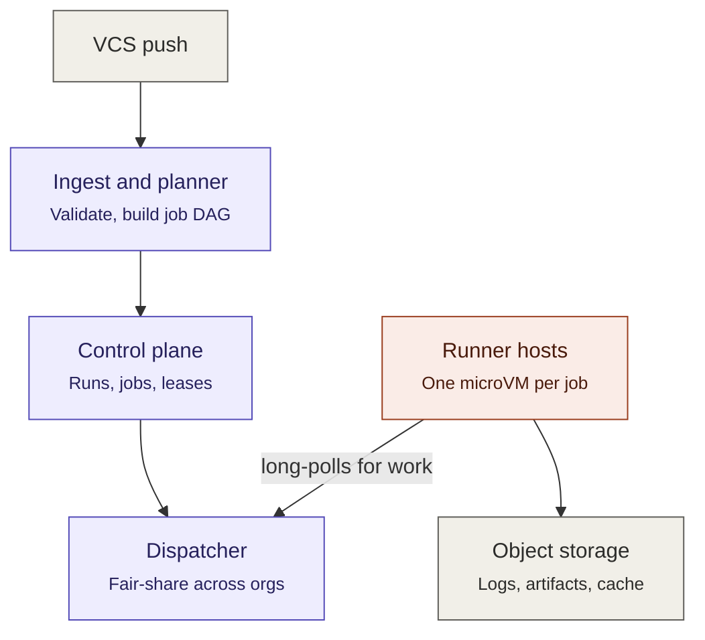

---
tags:
  - interview-prep
  - system-design
---
# Multi-Tenant CI/CD System ("Design GitHub Actions")
Target: core design complete by minute 35, two deep dives, then scaling pressure.
## Prompt
Design a service where organizations define pipelines in config (build -> test -> deploy steps), triggered by code pushes.
* Runs execute in isolated environments.
* Thousands of orgs
* Spiky load.

**Follow-up script:**

Where do jobs run and how do you isolate tenants (containers? VMs? why)?

Scheduler design -
* Fairness across orgs when one org submits 10k jobs.
* A worker dies mid-job - what happens?
* Caching build artifacts across runs. How do you handle secrets?

Logs - 
* Streaming live to the browser while the job runs - design that path. (You've built much of this - practice presenting it as _derived from requirements_, not recalled.)

### Walk through it
YAML config in the repo defining a DAG of jobs; push/PR webhook triggers to run. Jobs execute isolated, in dependency order, with parallelism; live log streaming; artifacts and dependency caching; secrets for deploy steps; status reported back to the VCS; cancel/retry.

Numbers for scale -
- 5k orgs
- ~500k runs/day
- ~4 jobs/run -- ~2M jobs/day -- ~25 jobs/sec
 
 Spiky for weekday morning-peaks, and merge queue bursts, so plan for 10x-20x -> ~500 jobs/sec. This works out to about 7k concurrent jobs on average, and 25k-30k at peak. That's a lot of cores, so capacity is a first-class problem here.

SLOs should target time from push to job starting.

#### Architecture

Let's walk through the individual pieces -

**Ingest**. Stateless HTTP behind load balancer. Validate HMAC signature, dedupe on delivery ID, append the raw event to a durable log (Kafka topic keyed by repo), return a 200 in under 50ms. Webhook senders have short timeouts and retry aggressively, so just queue and return, don't try to do anything inline here.

**Planner**. Consumers events, resolves repo -> org, checks quota, fetches the config file at _the pushed SHA_, parses it, validates the DAG, evaluates branch / path filters, then transactionally writes a `Run`plus its `Job` rows to Postgres. Two things to call out here -
- The config file should be treated as untrusted input from thousands of tenants, so it needs hard limits
	- Max jobs
	- Max matrix size
	- Max DAG depth
	- non-turing-complete expression evaluation
...and when a job doesn't match these filters we should just skip it.

**Control-plane storage**. Postgres. `runs`, `jobs`, `steps`, plus append-only `job_events` table for audit and state-machine debugging. A few thousand state transitions per second at peak is comfortably single-primary territory; time-partition `jobs`, and shard on org later rather than reaching for NoSQL on day one. The job state machine is `queued -> leased -> running -> success, failed, cancelled, timed_out, infra_failed}`, with transitions guarded by optimistic concurrency (`WHERE status = 'RUNNING' AND attempt=3`). DAG progression is driven by a reconciler that reads terminal jobs and enqueues newly eligible ones - plus a periodic sweeper, because anything that solely depends on an event firing will eventually wedge.

```sql
create table orgs (
  id                bigint primary key,
  slug              text not null unique,
  plan              text not null,                    -- free | team | enterprise
  suspended_at      timestamptz
);

create table repos (
  id                bigint primary key,
  org_id            bigint not null references orgs,
  provider          text not null,                    -- github | gitlab
  provider_repo_id  text not null,
  installation_id   bigint not null,                  -- for minting scoped tokens
  default_branch    text not null,
  unique (provider, provider_repo_id)
);

create type run_status as enum
  ('pending','running','success','failed','cancelled','skipped','infra_failed');

create table runs (
  id                bigint primary key,               -- time-sortable (snowflake), not uuid4
  org_id            bigint not null,
  repo_id           bigint not null,
  event_type        text not null,                    -- push | pull_request | schedule | manual | api
  commit_sha        char(40) not null,
  ref               text not null,
  base_sha          char(40),                         -- PRs: config resolved from here
  trusted           boolean not null,                 -- false for fork PRs -> no secrets
  actor             text not null,
  config_digest     bytea not null,                   -- sha256 of resolved config
  dag               jsonb not null,                   -- frozen plan; never re-derived
  concurrency_group text,                             -- e.g. 'repo:42:refs/heads/main'
  status            run_status not null default 'pending',
  created_at        timestamptz not null default now(),
  started_at        timestamptz,
  finished_at       timestamptz
) partition by range (created_at);

create table webhook_deliveries (
  provider     text not null,
  delivery_id  text not null,
  run_id       bigint,                                -- null if event produced no run
  received_at  timestamptz not null default now(),
  primary key (provider, delivery_id)
);

create type job_status as enum
  ('blocked','queued','leased','running','success','failed',
   'cancelled','timed_out','infra_failed','skipped');

create table jobs (
  id                bigint primary key,
  run_id            bigint not null,
  org_id            bigint not null,                  -- denormalized: dispatcher never joins
  name              text not null,
  needs             text[] not null default '{}',
  pending_deps      int not null,                     -- counter; 0 => eligible
  pool              text not null,                    -- ubuntu-4x | arm64 | self-hosted:acme
  image_digest      text not null,
  timeout_sec       int not null,
  idle_timeout_sec  int not null,
  retryable         boolean not null default true,    -- false for deploy jobs
  status            job_status not null,
  attempt           int not null default 0,
  max_attempts      int not null default 3,           -- infra retries only
  cancel_requested  boolean not null default false,
  lease_id          uuid,
  lease_runner_id   text,
  lease_expires_at  timestamptz,
  fence             bigint not null default 0,        -- monotonic per job
  enqueued_at       timestamptz,
  started_at        timestamptz,
  finished_at       timestamptz,
  exit_code         int,
  unique (run_id, name)
);

create index jobs_dispatch on jobs (pool, org_id, enqueued_at)
  where status = 'queued';
create index jobs_expiry on jobs (lease_expires_at)
  where status in ('leased','running');
  
create table org_pool_concurrency (
  org_id           bigint not null,
  pool             text not null,
  running          int not null default 0,
  max_running      int not null,
  last_dispatch_at timestamptz not null default now(),
  primary key (org_id, pool)
);
```

**Dispatcher**. This is probably gonna be where we spend most of our time.
- _Fairness_. One global FIFO is trivially correct and has terrible tail behavior. One org pushing to a monorepo with a 2000-job matrix starves everyone behind it. So per-org queues with deficit round-robin over orgs that have capacity, plus plan-based per org concurrency caps.
- _Queue substrate_. Let's use a Postgres table with `SELECT ... FOR UPDATE SKIP LOCKED` rather than Kafka, with the deciding argument being cancellation. You can't pull a job out of a Kafka topic and "cancel this run" is a core feature. Kafka can stay on the ingest path where it fits better.
- _Pull, not push_. Runners long-poll for work matching their labels. This gives natural backpressure, and works for runners behind NAT (which will be needed for self-hosted runners), and means our control-plane doesn't need to worry about runner addresses. The cost is a little extra dispatch latency, which streaming gRPC or long-poll mostly hides.
- _Leases and fencing_. Each dispatch grants a lease with expiry and a monotonic fencing token; heartbeats extend it. Lost heartbeat -> lease expires -> requeue as a new attempt. The fencing token is what stops a runner that comes back from a network partition from reporting success on an attempt thats already been retired elsewhere.

All the runners poll this `/acquire` endpoint looking for work. Once they get jobs assigned, they keep polling `/acquire` until they reach the host's concurrency limit, but also start polling `/heartbeat` for each job it owns. We keep track in the database or somewhere that the heartbeat has happened (maybe update a timestamp or something). Then if we see that a job hasn't had a heartbeat in a configurable amount of time, we assume the runner died and try to reassign it.

Also, the heartbeat endpoint for the job returns the status or something, and if we see that its cancelled, the runner kills the job.

**Isolation**. Assume every job to run is hostile - trying to escape the sandbox, mine crypto, or read another tenant's secrets. Three options -
- Containers running on a shared kernel. Fast, cheap, weak boundary.
- MicroVMs like firecracker or Kata. ~125ms boot, own kernel, near container density.
- Full VMs. 30s-60s boot, strongest isolation.
One MicroVM per job is probably the best pick. To be destroyed afterwards, never to be reused. Then defense in depth, no egress without allowlisting through a proxy. Also a per-job identity with no host-based credentials. Have a trusted and untrusted node pool, untrusted nodes should not be allowed to grab secrets. The idea is that forks of projects go to untrusted nodes, to protect the org owner's secrets.

For the MicroVMs, pre-bake rootfs images.

**Spiky load**. Two levels of autoscaling. Our node agent bin-packs microvms onto hosts, and the cluster autoscaler adds hosts. This should scale on queue wait time, and depth per queue **not CPU usage** - CPU is a lagging indicator, and queue wait is the SLO. Since the VM boot takes seconds but acquiring a host takes minutes you need headroom sized by your P99 job burst amount, plus scaling based on daily / weekly / seasonality. Jobs are retryable, so preemption is survivable so long as you classify it as `infra_failure` and show the user a red x.

**Logs**. This is the highest volume path, and worth treating separately. Runners batch, gzip, and sequence number log chunks to an ingest service, which fans out live viewers over SSE / Websockets via a per-job / per-node sub channel, and periodically seals chunks into object storage with a line offset index so we can rebuild it in the UI later. Logs never go into Postgres itself

**Artifacts & cache**. Signed URLs, uploaded runner -> object storage directly, never proxy gigabytes through the control-plane. Cache scoping matters - a PR branch can read main's cache but writes go into its own scope, otherwise cache poisoning becomes a supply chain attack.

**Status reporting**. Posting check runs back to the VCS is an outbound call to a rate-limited third-party which will be down sometimes, so it goes behind a durable retry-queue with per-installation rate-limiting. A VCS API outage must not fail out runs.

#### Trade-offs
- MicroVM vs containers - MicroVM - for security over cold-start, and cost.
- Pull vs push dispatch - Pull - NAT friendliness and backpressure against latency.
- Fair-queueing vs FIFO - Fair queueing - small-org tail latency vs scheduler complexity.
- Mutable Postgres vs Kafka - Postgres - need the ability to cancel jobs.
- Spot instances vs on demand - Cost vs churn.

Also one important thing. Web-hooks are **at least once** delivery. So idempotency is important. Use `(repo, delivery_id)` to dedupe.

#### Edge cases
- Push A then push B to the same branch within 5 seconds. Have the latest event automatically cancel superseded runs by concurrency group, but never auto-cancel a deployment in flight.
- For a PR from a fork, read the config from the base branch not the fork - otherwise the attacker can rewrite the pipeline and do some bad stuff.
- Force push, or branch deletion while queued - key everything off of a SHA, not a branch name.
- Runner dies mid job - lease expiry retries it, but only for infra failures, and with a retry cap so a job that reliably OOMs doesn't hold the resources forever.
- Idle timeout and wall-clock timeout, both hard-capped, for jobs that just hang forever.
- A script pushing 200 branches at once - rate limits.
- Cancellation arrives between dispatch and start - cancellation is durable state which the runner rechecks before reconciling every lease renewal.
- Popular base image gets invalidated - every node pulls at once, needs a pull-through registry cache.