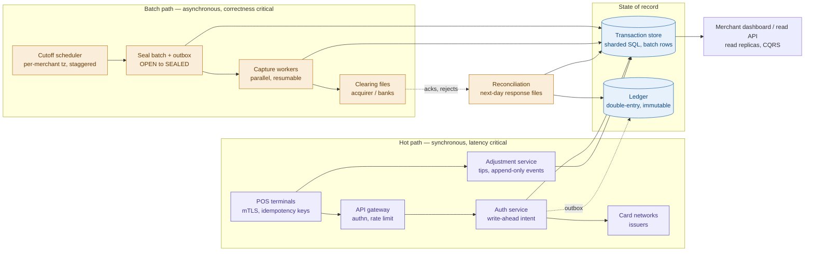
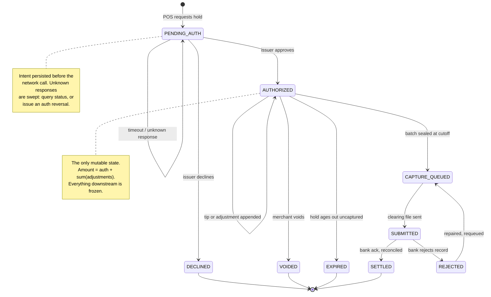
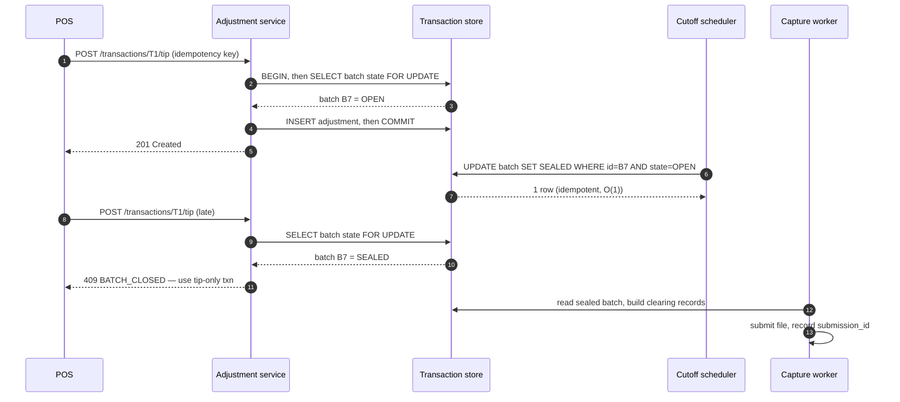

---
tags:
  - interview-prep
  - system-design
---
# Payments Pipeline

## Prompt
Design a payment system: we authorize a charge with an external processor at purchase time, hold funds, and batch-settle daily. The processor is flaky - timeouts and ambiguous failures happen. Correctness is non-negotiable.

**Follow-up script:**
* The processor call times out - did the charge happen or not?
* Walk through your state machine.
* Idempotency keys - who generates them and where are they checked?
* Daily settlement job fails halfway - recovery?
* Reconciliation: our records vs. the processor's report disagree - design the process.
* Exactly-once - is it achievable? What do you actually promise?

## Walk through it
You own a payment platform which sits in between a vendor and a processor (processor being a bank) al-la stripe. Vendor's point-of-sale systems send you transactions and you need to issue "holds" to reserve funds. Vendors can update these transactions at a later time to add tips, etc. Every night around 10pm your system takes the holds for the day and issues a charge to the appropriate processor downstream. These charges are provided to the processors in the form of a file. This will actually distribute funds. Design a system to fulfill these requirements.
### Follow-ups to ask
* Given we sit in the middle, do we ever _hold_ funds, or are we simply a pass-through?
* Is the 10PM job local to each merchant? UTC time?
* What is the downstream contract? SFTP? Real-time API? Something else?
* Do we need to handle disputes?
* Can a tip be added _after_ a charge is done?
* What volume are we seeing with this? Given this is an interview I assume a lot?
### Assumptions for this write-up
* We front card-present terminals
* Cut off time is local to merchants and configurable
* Scale
	* 100k vendors / merchants
	* 20M transactions/day
	* ~230 TPS average
	* Spikes of ~2k-3k TPS at lunch / dinner peaks
	* ~1KB/transaction record
	* 1KB * 20M = 20k MB (million becomes thousand in the conversion) or 20GB
### The core of the problem
20GB/day is not a big data problem. The real heart of this question is idempotency & correctness during partial failure.

You need two parts to your system here -
* The hot path, where latency matters is auth + hold. This is what vendors systems will interact with directly so they need a response to be able to continue.
* The cold path, where charges are actually issued. There is no human waiting on this to finish. Correctness, durability, and idempotency matter here (do not issue the same charge more than once).

**The hot path** is pretty straight forward, you have an API you expose which writes your transaction records and you have a state machine to track where everything is at (charged, vs pending, vs hold, etc).

**The cold path** is also pretty straight forward, but there are some key things to consider here. Instinctually, you'll think "okay, we do a cron to process everything", but there are some issues with this. A single cron job processing all this data would be slow, a single point of failure, and you risk thundering herds. Plus, you have to deal with races for tips coming in 1 minute before the 10pm cutoff. The better approach here is processing transactions in batches. Every merchant will have exactly one `OPEN` batch, transactions are assigned to a batch based on the transaction time NOT the cutoff time. This makes the batch cutoff a simple O(1) operation for every merchant -
```sql
UPDATE batch SET state='SEALED', sealed_at=now()
WHERE id=? AND state='OPEN'
```
### Architecture
Here is the overall idea -

Lets go into individual components -
* **Auth Service / API Gateway** - This service should be deliberately thin. Every dependency of the hot path is a liability, so risk checks are in-process or cached (Redis for rate limiter).
* **Transaction store** is a sharded relational DB - Postgres / Aurora sharded by `merchant_id`, or CockroachDB / Spanner for strong cross region consistency.
	* I would explicitly reject NoSQL like DynamoDB / Cassandra as a source of truth for this. For our batching, we want multi-row operations for our batching, and we're dealing with money, so eventual consistency of a NoSQL database is a big no-no.
	* Sharding by `merchant_id` is the right key because our batches would never span merchants. So sealing 
* **Ledger** - a separate, append-only, double-entry. This will act as an auditor's answer to "where is the money" and it's what we can reconcile against. Keeping it distinct from the operational transaction store means the state-machine can be optimized for reads while the ledger stays immutable.
	* **Note:** This sounds like a good use-case for a kafka topic, and technically you could do that, but if we do that, we'd need to store the events in some offline store (HDFS) and have some other technology for querying (Trino). It'd probably be easier to just have a separate table in our SQL DB for this and then simply just choose to never `UPDATE` or `DELETE` from it. While the HDFS based approach could work, the SQL based approach affords us atomic transactions and uniqueness constraints which is very helpful!
* **Kafka** - partitioned by `merchant_id` - gives us ordering per merchant, which is what matters, without needing global ordering.

Idempotency should be enforced using an `idempotency_key`. We can generate this as a uuid from the point-of-sale system, and propagate it throughout our backend. This ID should also have a uniqueness constraint on it in our database so that we get hard failures when we try to append to our ledger. If a backend instance succeeds in the write, then congrats! you own the transaction. If you fail on uniqueness that means some distributed-system funk is going down, and you should just fail, as we've somehow duplicated the transaction.
### The state machine

The `AUTHORIZED` state is the mutable window. Everything after it is frozen.

#### Failure modes to expect

* Tips / transaction mutations coming in after a charge is issued (batch is sealed) should be rejected with a 409
* Tips / mutations on a void or cancelled transaction should also be rejected
* Bank is down at 10PM - This is fine, this is the cold path, so latency doesn't matter much, we can retry with an exponential backoff, and alert if a batch exceeds some agreed upon SLA.
* Double submission - Bank-side needs some awareness of our batches for idempotency. We don't control their API, let's assume they give us back a `submission_id` for each file we send over. On our side, we can track the SHA of the file we submit with the submission ID they give us. This way, we know what we've submitted or not.
* Scheduling failures - A single global cron is an obvious single point of failure. Use per-merchant scheduled tasks in a durable store with leader election, jittered by shard. Our seal operation should be idempotent, this way dupe submissions cannot happen.
* Reconciliation - The following morning we ingest bank response files, match them against our submission and produce a break-report. Plus our continuous ledger tracking changes. This is not optional, since we're dealing with financial data.
* Poison records - Send them to a DLQ and have some ops-tools for manual fixes.
#### Trade-offs
| Decision                | Choice                 | Trade-off to acknowledge                                                                                                                                                                                          |
| ----------------------- | ---------------------- | ----------------------------------------------------------------------------------------------------------------------------------------------------------------------------------------------------------------- |
| Batch assignment timing | At auth                | Slight write-cost per auth; buys O(1) sealing and kills the cutoff race.                                                                                                                                          |
| Tips                    | Append-only events     | More storage and a `SUM` on read; buys audit, idempotency, concurrency.                                                                                                                                           |
| Store                   | Sharded SQL            | Harder to scale writes than KV store; buys multi-row atomicity for money.                                                                                                                                         |
| Late tips               | Hard reject after seal | Worse UX; prevents double charging.                                                                                                                                                                               |
| Capture orchestration   | Kafka + workers        | Temporal / durable workflows would be less code and give free retries and visibility; Kafka is more operationally familiar and better at throughput. You can consider Temporal here and let the interviewer push. |
| Sync capture to auth    | Rejected               | Impossible given tips, and downstream clearing is inherently batch.                                                                                                                                               |
### API Contracts
**Layer 1 - Point-of-sale -> Public API**
```
POST /v1/charges
Idempotency-Key: 7f3c9a21-4b8e-4d1a-9c33-1e5f8a2b6d40
Authorization: Bearer <merchant key>   # plus mTLS client cert

{
  "amount_minor": 4000,
  "currency": "USD",
  "capture_method": "manual",
  "payment_method": { "type": "card_present", "token": "tok_9f8e7d" },
  "terminal_id": "trm_4a2b",
  "entry_mode": "chip",
  "reference": "check-1042",
  "metadata": { "server": "emp_88", "table": "12" }
}
```

```
201 Created

{
  "id": "txn_01J8F3K9Q2",
  "status": "authorized",
  "auth_amount_minor": 4000,
  "capture_amount_minor": 4000,
  "currency": "USD",
  "batch": { "id": "bat_01J8F0", "business_date": "2026-08-01", "state": "open" },
  "adjustment_headroom_minor": 800,
  "card": { "brand": "visa", "last4": "4242", "funding": "credit" },
  "network": { "auth_code": "A82F1C", "response_code": "00" },
  "auth_expires_at": "2026-08-08T03:59:00Z",
  "created_at": "2026-08-01T19:42:11Z"
}
```
`adjustment_headroom_minor` is just the server telling the merchant how much tip they're authorized to add. This may or may not come in in an actual interview.

**Tip adjustment**
```
POST /v1/charges/txn_01J8F3K9Q2/adjustments
Idempotency-Key: c1d9e4f0-...

{ "type": "tip", "amount_minor": 800, "actor": "emp_88" }
```

```
200 OK

{
  "id": "adj_01J8F5M1",
  "transaction_id": "txn_01J8F3K9Q2",
  "capture_amount_minor": 4800,
  "adjustments": [ { "id": "adj_01J8F5M1", "type": "tip", "amount_minor": 800 } ],
  "batch": { "id": "bat_01J8F0", "state": "open" },
  "incremental_auth": null
}
```
**Two failure responses matter.** One consistent error envelope everywhere -
```
409 Conflict
{ "error": { "code": "batch_closed",
             "message": "Batch sealed at 22:00:00Z; adjustments no longer accepted.",
             "batch_id": "bat_01J8F0",
             "remediation": "create_tip_only_charge" } }

422 Unprocessable
{ "error": { "code": "idempotency_key_reuse",
             "message": "Key was used with different request parameters." } }
```
`remediation` is a machine readable enum which the point-of-sale system could handle if they were to implement some resilient fallbacks.

**Layer 2 - Auth service -> internal backend**
You don't really need to use gRPC, but proto makes it easy to describe these contracts here -
```
message AuthorizeRequest {
  string transaction_id   = 1;   // our idempotency anchor
  string pan_token        = 2;   // vault reference, never a PAN
  int64  amount_minor     = 3;
  string currency         = 4;   // ISO 4217 numeric
  string mcc              = 5;
  string entry_mode       = 6;
  string acquirer_bin     = 7;
  bytes  emv_data         = 8;
}

message AuthorizeResponse {
  Outcome outcome         = 1;   // APPROVED | DECLINED | UNKNOWN
  string  response_code   = 2;   // "00", "51", "05"
  string  auth_code       = 3;
  string  network_ref     = 4;   // RRN / ARN
  int64   approved_amount_minor = 5;  // partial approvals
  google.protobuf.Duration latency = 6;
}
```
**Note:** This structure maps to [ISO 8583](https://en.wikipedia.org/wiki/ISO_8583) which I've never dealt with directly, but it's basically the spec for financial transactions.

**Layer 3 - Ledger posting API**
```
POST /internal/ledger/entries

{
  "idempotency_key": "txn_01J8F3K9Q2:capture",
  "entry_type": "capture",
  "effective_date": "2026-08-01",
  "transaction_id": "txn_01J8F3K9Q2",
  "postings": [
    { "account": "settlement_receivable:acq_wells", "direction": "debit",  "amount_minor": 4800 },
    { "account": "merchant_payable:mer_77",          "direction": "credit", "amount_minor": 4631 },
    { "account": "fee_revenue:USD",                  "direction": "credit", "amount_minor":  169 }
  ]
}
```
A replay returns `200` with the existing group rather than a `409` - the caller wants "this is done", not an error to handle.

**Layer 4 - capture worker -> bank**
```
batch_reference   BAT-MER77-20260801-01     ← the downstream idempotency key
merchant_id       MER77
network_ref       RRN from the original auth   ← links clearing to the hold
auth_code         A82F1C
auth_amount       4000
clearing_amount   4800
tip_amount         800                        ← some schemes want this itemized
transaction_date  2026-08-01
```
### Schema
**Core lifecycle** - Note the composite primary keys - `merchant_id` leads so everything colocates in one shard.
```sql
CREATE TABLE transactions (
  merchant_id            TEXT   NOT NULL,
  id                     TEXT   NOT NULL,
  batch_id               TEXT   NOT NULL,
  terminal_id            TEXT   NOT NULL,
  idempotency_key        TEXT   NOT NULL,
  request_hash           BYTEA  NOT NULL,      -- detects key reuse w/ different params
  state                  TEXT   NOT NULL,
  state_version          INT    NOT NULL DEFAULT 1,   -- optimistic concurrency
  auth_amount_minor      BIGINT NOT NULL,
  capture_amount_minor   BIGINT,               -- frozen snapshot, written at seal
  currency               CHAR(3) NOT NULL,
  pan_token              TEXT   NOT NULL,
  card_last4             CHAR(4),
  card_brand             TEXT,
  auth_code              TEXT,
  network_ref            TEXT,
  auth_expires_at        TIMESTAMPTZ,
  created_at             TIMESTAMPTZ NOT NULL,
  updated_at             TIMESTAMPTZ NOT NULL,
  PRIMARY KEY (merchant_id, id),
  FOREIGN KEY (merchant_id, batch_id) REFERENCES batches (merchant_id, id)
);

CREATE UNIQUE INDEX ON transactions (merchant_id, idempotency_key);
CREATE INDEX ON transactions (batch_id, state);          -- capture worker scan
CREATE INDEX ON transactions (merchant_id, created_at DESC);  -- dashboard
CREATE INDEX ON transactions (state, created_at)
  WHERE state = 'PENDING_AUTH';                          -- unknown-response sweeper
CREATE INDEX ON transactions (auth_expires_at)
  WHERE state IN ('AUTHORIZED', 'CAPTURE_QUEUED');       -- expiry alerting
```

```sql
CREATE TABLE adjustments (
  merchant_id      TEXT   NOT NULL,
  transaction_id   TEXT   NOT NULL,
  id               TEXT   NOT NULL,
  type             TEXT   NOT NULL,   -- TIP | SURCHARGE | DISCOUNT | REVERSAL
  amount_minor     BIGINT NOT NULL,   -- signed
  currency         CHAR(3) NOT NULL,
  idempotency_key  TEXT   NOT NULL,
  actor            TEXT,              -- employee / terminal, for fraud forensics
  created_at       TIMESTAMPTZ NOT NULL,
  PRIMARY KEY (merchant_id, transaction_id, id)
);

CREATE UNIQUE INDEX ON adjustments (transaction_id, idempotency_key);
```

```sql
CREATE TABLE batches (
  merchant_id        TEXT   NOT NULL,
  id                 TEXT   NOT NULL,
  business_date      DATE   NOT NULL,
  state              TEXT   NOT NULL,  -- OPEN|SEALED|BUILT|SUBMITTED|ACKED|CLOSED
  version            INT    NOT NULL DEFAULT 1,
  txn_count          INT    NOT NULL DEFAULT 0,
  gross_amount_minor BIGINT NOT NULL DEFAULT 0,
  cutoff_at          TIMESTAMPTZ NOT NULL,   -- computed from merchant tz
  opened_at          TIMESTAMPTZ NOT NULL,
  sealed_at          TIMESTAMPTZ,
  submitted_at       TIMESTAMPTZ,
  PRIMARY KEY (merchant_id, id)
);

-- Exactly one open batch per merchant, enforced by the database:
CREATE UNIQUE INDEX one_open_batch ON batches (merchant_id) WHERE state = 'OPEN';

CREATE UNIQUE INDEX ON batches (merchant_id, business_date);
CREATE INDEX ON batches (state, cutoff_at) WHERE state != 'CLOSED';
```

```sql
CREATE TABLE capture_submissions (
  id                  TEXT PRIMARY KEY,
  merchant_id         TEXT NOT NULL,
  batch_id            TEXT NOT NULL,
  attempt_no          INT  NOT NULL,
  external_reference  TEXT NOT NULL,   -- what the bank dedupes on
  file_uri            TEXT,            -- s3://...
  content_hash        BYTEA,
  state               TEXT NOT NULL,   -- BUILT|SENT|ACKED|REJECTED
  sent_at             TIMESTAMPTZ,
  acked_at            TIMESTAMPTZ
);

CREATE UNIQUE INDEX ON capture_submissions (batch_id, attempt_no);
CREATE UNIQUE INDEX ON capture_submissions (external_reference);

CREATE TABLE clearing_record_results (   -- per-item, for partial rejects
  submission_id  TEXT NOT NULL,
  transaction_id TEXT NOT NULL,
  status         TEXT NOT NULL,
  reject_code    TEXT,
  reject_reason  TEXT,
  PRIMARY KEY (submission_id, transaction_id)
);
```

The ledger -
```sql
CREATE TABLE accounts (
  id             TEXT PRIMARY KEY,
  account_type   TEXT NOT NULL,   -- MERCHANT_PAYABLE|SETTLEMENT_RECEIVABLE|FEE_REVENUE|CASH
  owner_type     TEXT,            -- MERCHANT|ACQUIRER|HOUSE
  owner_id       TEXT,
  currency       CHAR(3) NOT NULL,
  normal_balance TEXT NOT NULL    -- DEBIT | CREDIT
);
CREATE UNIQUE INDEX ON accounts (owner_type, owner_id, account_type, currency);

CREATE TABLE entry_groups (
  id              TEXT PRIMARY KEY,
  idempotency_key TEXT NOT NULL,
  entry_type      TEXT NOT NULL,
  transaction_id  TEXT,
  effective_date  DATE NOT NULL,
  created_at      TIMESTAMPTZ NOT NULL
);
CREATE UNIQUE INDEX ON entry_groups (idempotency_key);   -- the dupe guard

CREATE TABLE postings (
  id              BIGSERIAL PRIMARY KEY,
  entry_group_id  TEXT   NOT NULL REFERENCES entry_groups (id),
  account_id      TEXT   NOT NULL REFERENCES accounts (id),
  direction       TEXT   NOT NULL,   -- DEBIT | CREDIT
  amount_minor    BIGINT NOT NULL CHECK (amount_minor > 0),
  currency        CHAR(3) NOT NULL,
  signed_minor    BIGINT GENERATED ALWAYS AS
                    (CASE WHEN direction = 'DEBIT' THEN amount_minor
                          ELSE -amount_minor END) STORED,
  created_at      TIMESTAMPTZ NOT NULL
);

CREATE INDEX ON postings (account_id, created_at);
CREATE INDEX ON postings (entry_group_id);
-- plus the DEFERRABLE constraint trigger asserting SUM(signed_minor) = 0 per group
```

```sql
CREATE TABLE outbox (
  id             BIGSERIAL PRIMARY KEY,
  aggregate_type TEXT NOT NULL,
  aggregate_id   TEXT NOT NULL,
  event_type     TEXT NOT NULL,
  payload        JSONB NOT NULL,
  created_at     TIMESTAMPTZ NOT NULL,
  published_at   TIMESTAMPTZ
);
CREATE INDEX ON outbox (id) WHERE published_at IS NULL;   -- drain queue

CREATE TABLE network_messages (   -- every auth attempt, for the sweeper + disputes
  id             BIGSERIAL PRIMARY KEY,
  transaction_id TEXT NOT NULL,
  message_type   TEXT NOT NULL,   -- AUTH|REVERSAL|INCREMENTAL|STATUS_INQUIRY
  outcome        TEXT NOT NULL,   -- APPROVED|DECLINED|UNKNOWN
  response_code  TEXT,
  network_ref    TEXT,
  latency_ms     INT,
  created_at     TIMESTAMPTZ NOT NULL
);
CREATE INDEX ON network_messages (transaction_id, created_at);
```

## TL;DR
Architecture -
* **Two systems, one mutable window** - Hot path (auth) = sync, availability + p99 latency, human waiting. Cold path (capture) = async batch, correctness + exactly-once, nobody waiting. Between them the amendment window, which is _why_ auth and capture are separate ops.
* **Hot path:** POS (mTLS + client-generated idempotency UUID) → gateway → auth service → network gateway → scheme/issuer. Auth service is deliberately thin; risk checks in-process/Redis.
* **Batches are DB rows that accumulate all day.** Transaction assigned to a batch at _auth_ time. `UNIQUE (merchant_id) WHERE state='OPEN'` enforces one open batch per merchant.
* **Cutoff is a state transition, not a job:** `UPDATE batch SET state='SEALED' WHERE id=? AND state='OPEN'`. O(1), idempotent, instant. Everything heavy becomes resumable async work.
* **State machine:** `PENDING_AUTH → AUTHORIZED → CAPTURE_QUEUED → SUBMITTED → SETTLED`, with `DECLINED / VOIDED / EXPIRED / REJECTED` off-ramps. **AUTHORIZED is the only mutable state.**
* **Tips = append-only `adjustments` rows**, not `UPDATE amount`. Capture amount = `auth + SUM(adjustments)` while open, frozen to a snapshot column at seal so file rebuilds are byte-identical.
* **Store:** sharded relational by `merchant_id` (Postgres/Aurora, or Cockroach/Spanner multi-region). Need multi-row atomicity; no eventual consistency near money.
* **Two aggregation boundaries that cross:** batch = 1 merchant × 1 date × mixed brands. File = 1 destination × 1 cycle × 1000s of merchants. Destination = `(scheme, acquiring_bin)`.
* **Pipeline changes key halfway:** seal + materialize keyed on `merchant_id` (single-shard) → **repartition** → assemble + transmit keyed on `destination_id` (cross-shard).
* **File assembly = two-phase claim:** create file `BUILDING` → `UPDATE clearing_records SET file_id=? WHERE destination_id=? AND file_id IS NULL` in chunks → flip to `BUILT`. Resumable; `IS NULL` predicate prevents double-claim.
* **Ledger is separate and append-only double-entry.** Not an event log. **A hold posts nothing; a tip posts nothing** - nothing has moved. Postings start at capture. Exposure goes in memo accounts.
* **Reconciliation:** ingest next-day response files, match submissions, emit break report + continuous ledger invariant check. It's the only thing that tells you the rest works.
* **Idempotency has two layers:** client-generated random UUID at the POS boundary (only the caller knows "same intent"); server-derived `{entity}:{op}[:{seq}]` internally. Store the response, not just the key; hash the request body to catch key reuse with different params.

Trade-offs to remember -
* **Batch assigned at auth, not at cutoff** - small extra write; buys O(1) sealing and kills the 21:59:59 race.
- **Tips as events, not mutations** - extra storage + `SUM` on read; buys audit trail, idempotency, concurrency safety.
- **Sharded SQL over KV** - harder write scaling; buys multi-row atomicity. 20M txn/day is a few GB - this is _not_ a big-data problem.
- **Shard by merchant** - makes seal/materialize single-shard, makes file assembly a cross-shard shuffle. Name this weakness yourself before they do.
- **Kafka as event backbone + the repartition, not as a work queue.** The destination shuffle is the strongest use. For distributing 100k batches, `FOR UPDATE SKIP LOCKED` or Temporal is simpler with better per-item visibility. At this volume, outbox + SNS/SQS would also do - Kafka is justified by consumer count and replay, not throughput.
- **Ledger in OLTP, not a lake.** Kafka→Iceberg→Trino can _detect_ imbalance, never _prevent_ it. Lake is a mirror (close, analytics, 7-yr retention), never the master.
- **Hard-reject tips after seal** - worse UX for forgetful servers; prevents double-charging a customer. Never unseal a batch. Grace period (seal 22:00, submit 22:15) covers most cases; past that, tip-only txn next day.
- **Tip past tolerance:** incremental auth (correct, adds a sync network call) → fallback to re-running the card. Tolerance is per-MCC config, never a constant.
- **Balances:** `SUM(postings)` is correct but slows down. Adding an `account_balances` row in the same txn buys O(1) reads at the cost of contention on hot house accounts like `fee_revenue` - shard those into buckets.
- **Bank down at 10pm is fine** (auths valid for days, huge slack); 30s down on the auth path is a store outage. Same company, opposite urgency.
- **Whole-file reject ≠ per-record reject.** Distinct code paths - conflating them means re-sending a good file or silently dropping 40k transactions.
- **Batch state is a rollup, not a state.** One batch's records span 3 files with 3 cycles; Visa can ack while Amex rejects. The dashboard must show partial settlement honestly.

Something that always confuses you -
* **Schema** - You're using a few SQL tables.
	* The `transactions` table contains the transaction uuid (idempotency). `merchant_id` + `uuid` must be unique. This table is for your state transitions and is mutable.
	* The `adjustments` table is for your amounts on your transactions, it is immutable and append-only. Each adjustment gets its own UUID as well, and for uniqueness `transaction_id` + `uuid` must be unique.
	* We can have a third `file_submissions` table to track the files we submit. It again will have its own uuid, a `sent_at`timestamp to track attempts, transport status (did it succeed?), file SHA (for integrity), and a `file_uri` pointing to the generated file in a blob store somewhere. The bytes of the file itself do not belong in a database!