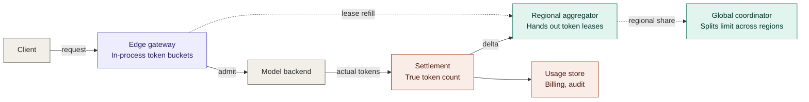

---
tags:
  - interview-prep
  - system-design
---
# Token Usage Monitoring / Metrics System

## Prompt
Every API request consumes tokens. Design the system that tracks usage per customer in near-real-time, powers a usage dashboard, enforces monthly quotas, and feeds billing. Millions of customers, ~1M requests/sec.

**Follow-up script:**
* Counting path: can you afford a synchronous DB write per request? (Aggregation windows, write-behind.)
* Quota enforcement needs to be fast AND roughly correct - where does the check live and how stale can it be?
* A customer disputes their bill - what's your source of truth vs. your fast path?
* Late/duplicate events. Dashboard query patterns vs. billing query patterns - one store or two?
## Walk through it

### Things to clarify
- **Is the token an LLM token or an abstract cost unit?** - Assuming LLM tokens. Input tokens are countable upon admission, but output tokens are unknown until the response completes.
- **What limit dimensions?** - RPM, input TPM, output TPM, concurrent requests, monthly spend. Hierarchical key -> project -> org.
- **Are limits global or per-region?** - Assume global per org.
- **Rate-limit or quota?** - These have different consistency requirements which would be designed separately. A TPM limit is soft and self-healing; a prepaid credit card balance of money.
- **Sub-millisecond at which percentile?** - p50 is easy, p99 is different. Assuming p99.
- **Fail open or fail closed** - when the limiter itself is degraded, what do we do?
- **Is a few percent of over-admission acceptable?** - Almost always yes, if the answer is no, push back on the latency requirement.

### The Scale
1M req/s x 5 limit dimensions = 5M counter operations per second, plus 1M events per second. Say 10M provisioned keys, ~1M active at any minute, ~10 counters each at ~100 bytes -> single digit GB of hot state. Memory resident and shardable.

The important note. Within AZ call to Redis round trip is ~0.3-0.5ms, but a call cross region is 30-150ms, and blows our budget. This means any global correctness needs to be achieved async.
### Architecture

**Tier 0, in-process in the gateway** - A flat array of token buckets keyed by `(key_id, dimension)`, guarded by atomic CAS, not locks. A bucket has two fields, `last_refill_ts` and `level`. Decision cost is a hash lookup and a compare / swap - tens of nanoseconds, no allocation, no syscall.

**Tier 1 - regional aggregator** - sharded by consistent hash over key id. It owns the region's authoritative counters and issues leases ("you may spend N tokens over the next 200ms"). Gateways refill at a threshold (say, 25%), so a refill will never occur during critical path. Leases carry a TTL, meaning that a dead gateway's allocation returns automatically.

**Tier 2 - global coordinator** - a slow control loop (~500ms) that observes per-region and divides the global limit proportionally, holding back ~10% for sudden regional shifts. It's a control plane, not a data plane.
#### Reserve and settle
This is what makes token limiting different than request rate limiting. At admission you know input tokens; **you do not know output tokens**. So this check is two-phase -
- **Reserve** at admission. `input_tokens + estimate(output)`. The naive choice is `max_tokens`, which is correct but catastrophic for utilization - most requests declare 4096 and use 300 so you'd reject 90% of admissible traffic.
- **Settle** at completion with authoritative count from the inference layer, applying the delta back to the bucket.

This bucket can go negative, and when it does, the delta should be brought over into the next window. This is fine, but we should cap the maximum "debt" to guard against runaway users. Settlement events must be idempotent using a `request_id` field.

For streaming, meter tokens as they are emitted not at the end, but allow in-flight requests to finish.
#### The algorithm to choose
We mentioned above we're going with a standard token bucket algorithm, so let's talk about why. There are two other alternatives here, each with their own issues -
- **Fixed-window** - Keep track of the number of tokens within the current minute (or whatever the time period is), and if we've past that, we can reset our count.
	- **The issue** - We risk bursting up to 2x our limit due to edge cases. For example, with a limit of 100 per minute, if we receive 100 at 0:59, and 100 more at 1:01, this blows our limit despite the algorithm allowing it.
- **Sliding-window** - Each request is added to a linked list which we can trim once the node's timestamp is outside our current window.
	- **The issue** - At 1M QPS adding a new node to a linked list for every single request is untenable.

Token bucket is simpler. They never run on a timer, on each request we look at the amount of time past since our previous refill of the bucket, our refill rate, and our last known token count to determine if we should allow or deny.
```python
class TokenBucket:
    def __init__(self, rate, capacity):
        self.rate = rate          # tokens per second (sustained)
        self.capacity = capacity  # burst ceiling
        self.level = capacity
        self.last = now()         # monotonic seconds

    def _refill(self, t):
        self.level = min(self.capacity, self.level + (t - self.last) * self.rate)
        self.last = t

    def try_consume(self, cost):
        t = now()
        self._refill(t)
        if self.level >= cost:
            self.level -= cost
            return True, 0.0
        retry_after = (cost - self.level) / self.rate
        return False, retry_after
```

#### Rate limits and quotas are different problems
It would be good to explicitly separate them and mention the differences.

| ...             | Rate limit (TPM / RPM)      | Quota (prepaid credits)            |
| --------------- | --------------------------- | ---------------------------------- |
| Error semantics | Transient, self healing     | Money, unrecoverable               |
| Enforcement     | Optimistic, local buckets   | Shrinking lease -> synchronous     |
| Failure mode    | Fail open                   | Fail closed past a grace threshold |
| Durability      | Soft state, reconstructable | Replicated log, must survive       |
The nice trick for quotas: size leases as a fraction of the remaining balance. With $10k left, hand out generous leases and don't care about precision. As the balance approaches zero, lease sizes shrink toward zero and enforcement naturally converges to a single owner CAS on the balance. Worst-case overshoot is bounded by `lease_holders x final_lease_size`, and you pay for precision only where it matters.
#### Trade-offs
**The long-tail sharding problem** - A key limited to 10 RPM spread across 500 gateways can't be leased - you can't hand out 0.02 tokens. Options -
- consistent-hash the API on l7 load balancer so a key lands on a small replica set
- classify keys and give cold keys a synchronous same AZ-check

**Accuracy vs latency** - We are choosing bounded over-admission - a few percent - in exchange for 100ns decisions. Make the bound explicit and configurable per tenant, and _measured_ to be used as an SLI.

**The metric everyone forgets** - False 429 rate. Under-admission is what customers actually complain about, and a system tuned only on "never exceed this limit" will quietly reject admissible traffic. Instrument in both directions.

**Degradation ladder** - Global tier down -> regions use last-known static shares, so total admission still ~= the global limit. Aggregator down -> gateways run on their last lease, then fall back to `limit / expected_gateway_count`. Config unavailable -> conservative default limits, never unlimited.
#### Edge-cases
Client disconnects mid-stream (settle at tokens actually generated); limit lowered while requests are in flight; a tenant shifting traffic between regions faster than the control loop reallocates (hence the reserve pool); long streams crossing window boundaries; tokenizer mismatch between the gateway's estimate and the model's real count; batch vs. interactive traffic sharing one budget, where batch should soak up headroom but yield instantly; clock skew, which argues for relative lease durations over absolute deadlines; a first-request cold start on an unseen key.
